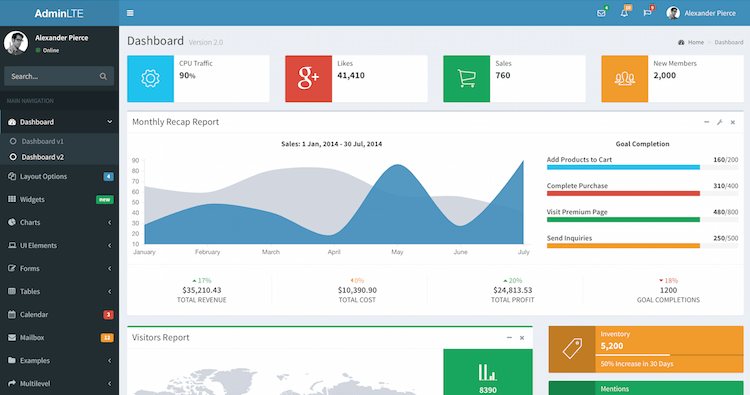

# AdminLTE Starter Kit for ASP.NET Core

**AdminLTE Starter Kit** is a boilerplate projects for ASP.NET Core Web Applications with a modern UI (based on [AdminLTE](https://adminlte.io) by Abdullah Almasaeed).




## 1. Getting Started

This template is open-source part of [.NET Express Project](https://dotnet.express). You can find samples, documentation and getting started instructions for [.NET Express Project](https://dotnet.express/templates) at the [Templates Documentation](https://docs.dotnet.express/templates/).

These instructions will get you a copy of the project up and running on your local machine for development and testing purposes.
See installing, configuration and deploy for notes on how to run the project on a live system.


### 2. Prerequisites

What things you need to install the software and how to install them

* [Visual Studio 2017+](https://www.visualstudio.com/vs/) / [Visual Studio Code](https://code.visualstudio.com/)
* [.NET Core SDK 2.2+](https://www.microsoft.com/net/download/)


### 3. Installing

#### 3.1. Installing from .NET Core CLI

You can install the ```dotnet new``` templates from [NuGet.org](https://www.nuget.org/) by running the following command:

```shell
dotnet new -i "Dynamic.NET.AdminLTE.ProjectTemplates"
```
Once installed your will have to new templates available to create AdminLTE MVC bootstrap web application.

```shell
dotnet new mvc-adminlte [options]
```

This will create a new web application in the current folder. 

#### 3.2. Installing from GitHub repository

You can clone source directly from GitHub

```shell
git clone https://github.com/dotnet-express/AdminLTE-Starter-Kit.git
```

## 4. Templates Settings

All configuration settings contains in ```appsettings.json```.

### 4.1. Database Connection

```json
"ConnectionStrings": {
    "DefaultConnection": "Server=(localdb)\\mssqllocaldb;Database=aspnet-Company.WebApplication1-53bc9b9d-9d6a-45d4-8429-2a2761773502;Trusted_Connection=True;MultipleActiveResultSets=true"
  },
```

### 4.2. Application Settings

All application configuration settings in ```appsettings.json```

```json
  "Email": {
    "EmailProvider": "", // Examples: "", "SendGrid"
    "SupportTeamEmail": "support@dotnet.express",
    "SupportTeamName": ".NET Express - Support Team",
    "SendGrid": {
      "KeyName": "{KEY NAME}",
      "ApiKey": "{API KEY}"
    }
  },

  "Authentication": {
    "Facebook": {
      "IsEnabled": "true",
      "AppId": "{APP ID}",
      "AppSecret": "{SECRET KEY}"
    },
    "Google": {
      "IsEnabled": "false",
      "ClientId": "{CLIENT ID}",
      "ClientSecret": "{SECRET KEY}"
    }
```


## 5. Bundling and Minification

For bundling and minification files from bundleconfig.json, used [BuildBundlerMinifier](https://www.nuget.org/packages/BuildBundlerMinifier/) from NuGet.
This template include "BuildBundlerMinifier 2.8.391"

After building, you must see this lines in build output:
```shell
  Bundler: Begin processing bundleconfig.json
  Bundler: Done processing bundleconfig.json
```

Detailed documentation you find in [Bundle and minifiy static assets in ASP.NET Core](https://docs.microsoft.com/en-us/aspnet/core/client-side/bundling-and-minification?view=aspnetcore-2.0&tabs=netcore-cli%2Caspnetcore2x#build-time-execution-of-bundling-and-minification). 


### 6. Library Manager

**This solution use Visual Studio Library Manager with config in ```libman.json``` and save all external libraries in ```\wwwroot\libs``` folder.**

[Client-side library acquisition in ASP.NET Core with LibMan](https://docs.microsoft.com/en-us/aspnet/core/client-side/libman/?view=aspnetcore-2.2)

For Visual Studio:

[Use LibMan with ASP.NET Core in Visual Studio](https://docs.microsoft.com/en-us/aspnet/core/client-side/libman/libman-vs?view=aspnetcore-2.2)

For Visual Studio Code/CLI:

[Use the LibMan command-line interface (CLI) with ASP.NET Core](https://docs.microsoft.com/en-us/aspnet/core/client-side/libman/libman-cli?view=aspnetcore-2.2)


## Contributing

Please read [CONTRIBUTING.md](CONTRIBUTING.md) for details on our code of conduct, and the process for submitting pull requests to us.

## Versioning

We use [Semantic Versioning 2.0](http://semver.org/) for versioning. For the versions available, see the [releases on this repository](https://github.com/dynamic-technologies/ASP.NET-Core-2.0-AdminLTE-Templates/releases). 

## Authors

* **[Leonid Shishkin](https://github.com/leonex)** - *Initial work*
* **[.Net Express Team](https://github.com/dotnet-express)** - *Support and development*

See also the list of [contributors](https://github.com/dotnet-express/AdminLTE/contributors) who participated in this project.

## License

This project is licensed under the MIT License - see the [LICENSE](https://opensource.org/licenses/MIT) file for details

## Acknowledgments

* [Abdullah Almasaeed](https://adminlte.io/about) for great [AdminLTE](https://adminlte.io) Template project.
